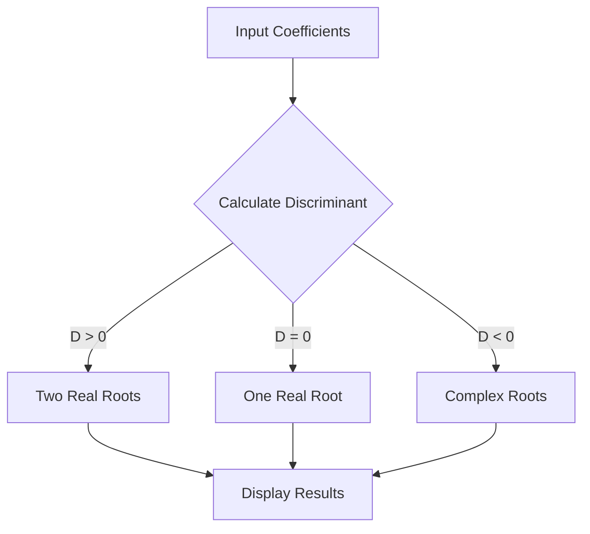

# Low-Level Systems Architecture

This repository serves as the foundation of my journey toward **Software Architecture**. Before mastering high-level distributed systems and DevOps, I chose to master the "metal"—understanding how data moves through registers, how memory is physically addressed, and how to optimize logic at the instruction level.

## Architectural Objectives

In these projects, I focused on three core pillars of systems engineering:

1. **Resource Efficiency:** Maximizing register reuse to minimize memory latency.
2. **Deterministic Logic:** Handling complex branching (Quadratic roots) and overflow protection in a low-level environment.
3. **Memory Mapping:** Manually calculating offsets for multi-dimensional data structures (Matrices).

## Project Highlights

### 1. Register & Logic Optimization

- **File:** `register_allocation_optimization.asm`
- **Concept:** Implemented a complex mathematical expression by strategically reusing registers.
- **Architectural Parallel:** This mirrors **In-Memory Caching**-keeping data as close to the "execution engine" as possible to avoid the cost of external fetches.

### 2. Memory Architecture & Matrix Engines

- **Files:** `matrix-offset-calculation.asm`, `2d-array-average.asm`
- **Concept:** Developed manual address calculation logic to traverse 4x4 matrices.
- **Architectural Parallel:** Understanding how databases handle **Physical Storage and Indexing**. By calculating `base_address + (row * row_size + col) * element_size`, I gained a deep understanding of data alignment.

### 3. Procedural Logic & FPU Operations

- **File:** `quadratic-solver.asm`
- **Concept:** A robust solver for real and complex roots, managing the stack and branching logic.
- **Architectural Parallel:** Demonstrates **Error Handling and Branch Prediction** logic at the most granular level.

## Logic Flow (Quadratic Solver)

